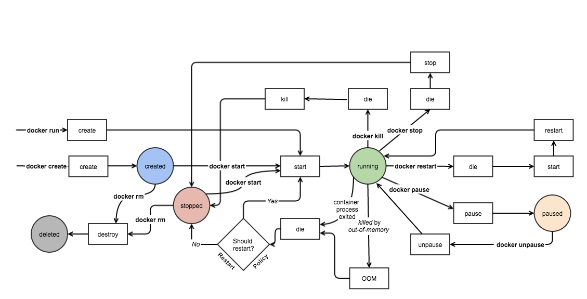

# Docker

## Docker-machine commands

=====================

When docker is installed, it comes with a single machine called default.

`docker-machine ls` => list all docker machines

`docker-machine start [machine name]`

`docker-machine stop [machine name]`

`docker-machine env [machine name]`

`docker-machine ip [machine name]`

`docker-machine status [machine name]`

to list all machine commands, `docker-machine help`

======================================
Error: Cannot connect to the Docker daemon at unix:///var/run/docker.sock. Is the docker daemon running?

solution: docker-machine env [machine name] => docker-machine env default

eval \$(docker-machine env default)

========================================
Docker client interacts with the docker daemon (docker engine) to help us to work with images and containers throught the cli

`docker pull [image name]`

`docker run [image name]`

`docker images`

`docker ps`

=====================================

#### How to save files onto the docker containers

Docker images are in form of layered file system each layer contains a unique identifier and the layers are read-only type.

a container however, creates a thin Read/Write layer that we can write to
but the layer is destroyed once the container is destroyed

therefore, so save files onto the docker containers that persist even after the container is destroyed, we make use of volumes

Volumes are a special directory in a container that keeps our files and does not get deleted even when the container is deleted.

They are mounted onto the Docker host - which is a space on the OS that docker is installed so the volume points to a the space in the host machine

***To CREATE A VOLUME***

`docker run - p 8080:3000 -v /var/www/ node`

* the `-v` creates a data volume in the running container
* the node is the image name
* the `-p` maps the port 8080 on the host to port 3000 in the container

**to locate where the volume of a container, run**

`docker inspect [container name]`

to set where docker container mounts the volume and write to, we can run the below command to set the location on the host

`docker run -p 8080:3000 -v \$(pwd):/var/www node`

`-v` creates a volume that points from the container `/var/www` to the present working directory

to run a node -express app and with start command from the node image

`docker run -p 8080:3000 -v \$(pwd):/var/www -w “/var/www” node npm start`

`\$(pwd)` - current working directory is mounted to the docker container 
`/var/www` which means you navigate to the project directory to run the container

you can stop and start the container

_to delete a container with its created vol, use_

`docker rm -v [container id]`

here's a really nice image of a docker container lifecycle



_Credit/src: [Nitin Agarwal](https://medium.com/@nagarwal/lifecycle-of-docker-container-d2da9f85959)_

#### BUILDING IMAGES USING DOCKERFILE

to build an image, you have to state the base image to which you can add other files/instructions to.

it adds a file layer to the image that you can save the source code or specify run instructions.

KEY METHODS/INSTRUCTIONS INCLUDE:
* FROM : state the base image to use
* LABEL: add meta data to the image
* ENV: specify the env variables
* COPY: specify file/dir to copy to the image file layer
* WORKDIR: the dir where the commands should be executed
* EXPOSE: the port the container should expose
* ENTRYPOINT: the command to start a service on the container
* RUN: the commands that should execute on the container
* VOLUME: state the files to be mounted on the host

__the build command is:__

`docker build -f DockerFileName -t tvpeter/node .`

* `t` specify the tag
* `.` specify the context the image should be build from

*** To run containers in a bridge network,***

* create a bridge network
    - `docker network create --driver bridge isolated_network`
        + `create` command creates the network
        + `--driver` makes use of the `bridge` network
        + `isolated_network` is the name of the network
* run containers in the network
    - `docker run -d --net=isolated_network --name mongodb mongo`
        + `--net` specifies the network
        + `--name` assigns the name `mongodb` to the container

*** to list networks on a machine, use the command***

`docker network ls`

** to inspect a network, use the command**

`docker network inspect network_name`

*to execute a command in a running container*

`docker exec containerName command`


### Docker Compose

Managing containers with legacy linking or bridge network becomes cubersome with more containers, docker compose is the answer.

It makes it easy to build images and containers and network them.

** Docker compose basic structure**

- version
- services: This is where we start what should be running when we build the images. They include:
    + build: we can indicate the build context
    + environment: testing, production etc
    + image: state which image to use and its source
    + networks: create and state network we want the containers to use
    + ports: we indicate which ports should be used by the containers
    + volumes: indicate where files should be saved

docker-compose.yml file example:

```
version: '2'

services:
    
    node: 
        build:
            context: .
            dockerfile: node.dockerfile
        networks:
            -nodeapp-network
    mongodb:
        image: mongo
        networks:
            -nodeapp-network
networks:
    nodeapp-network
    driver: bridge

```

* `node:` name of a service
* `build:` indicates that we want a custom build of `node.dockerfile`
* `context: .` build the image from the current folder
* the `mongodb` service is making use of `mongo` image from the dockerhub to build the service and it is also going into the nodeapp-network
* the `networks` creates a network that is used by the services

*** Docker-compose commands***

- `docker-compose build`: build/rebuild the services into the images
- `docker-compose up`: create and start up containers
- `docker-compose down`: stop running containers
- `docker-compose logs`: view the logs from the compose
- `docker-compose ps`: to list running containers
- `docker-compose start`: start the services
- `docker-compose stop`: stop the services
- `docker-compose rm`: to remove the containers

*** docker-compose workflow***
1.  docker-compose build
2.  docker-compose start-up
3.  docker-compose tear down

`docker-compose build` - to build all the services
`docker-compose build mongo` - to build/rebuild a single mongo service
`docker-compose up --no-deps node`- recreate the node service without recreating the dependent services/linked services in the network
`docker-compose down` stops and removes all containers
`docker-compose down --rmi all --volumes` 

